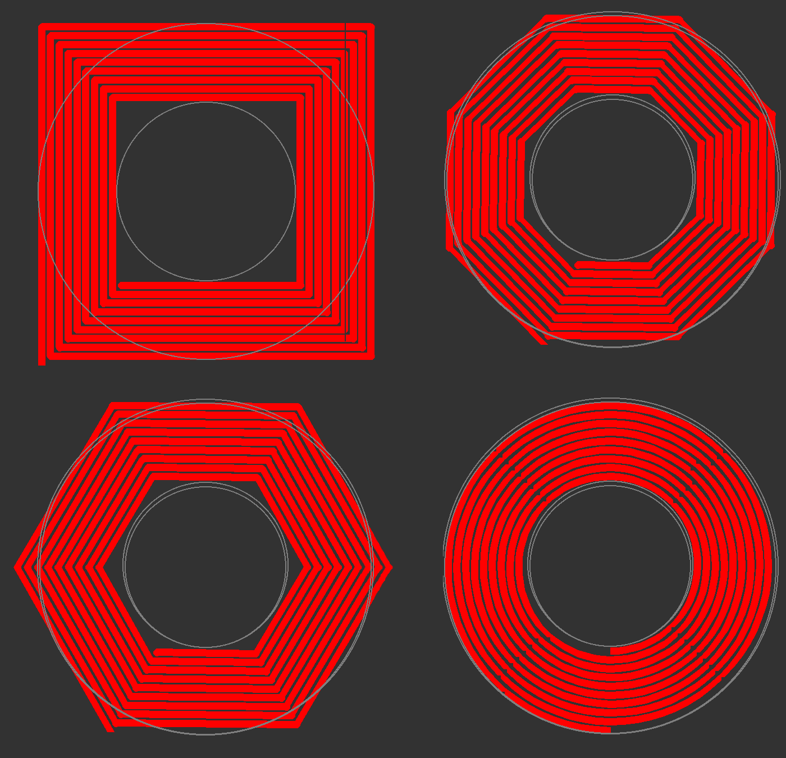
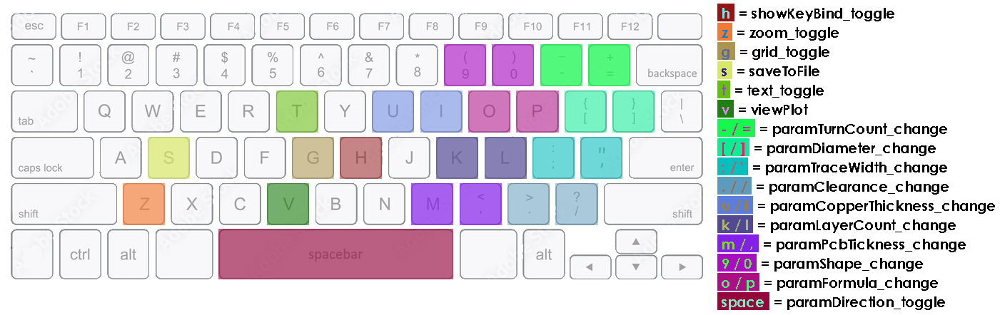

# PCBcoilGenerator
a python-based PCB-coil (planar inductor) generator. Visualization in python using pygame. 
V0 can generate basic 1-layer coils (with some deviation from the source material),
V1 can generate multilayer coils (with parameters as described in the papers)
V2 comes with multi-layer-coupling-factor coefficients adjusted based on test samples i made
The original math came from 3 papers:
- [1] provides the math for single-layer coils
- [3] provides the math for multilayer coils
- [2] fills in the gaps left in [3]
For my data/analysis/results, please see the the PDF in the 'documentation' folder.

screenshot:  

<!--  -->

shapes currently supported: (screenshots)  
  
<!--  -->  
more (custom) shapes are technically possible (the class structure is there), but paper [1] doesn't provide parameters for arbetary shapes.

requirements:
- python 3.10ish (tested with 3.10.8)
libraries:
- numpy (tested with 1.23.4)
- pygame (tested with 3.10.8) (only needed for visualization) (CV2 version is on TODO list)
- dxfwrite (tested with 1.2.2) (only needed for DXF exporting)
- pandas (tested with 1.5.2) and openpyxl (tested with 3.0.10) (only needed for excel exporting) (non-pandas version is on TODO list)
- opencv-python (tested with 4.6.0.66) (only needed for image exporting (cv2exporter.py))
- matplotlib (tested with 3.6.2) (only needed for matplotlibRenderer.py (currently useless))

file explenations:
- PCBcoilV_.py is the main file where all the fun stuff happens
- pygameRenderer.py holds all the drawing and window-management functions
- pygameUI.py is just for the keyboard/mouse input in pygame. It quickly gets messy, so i put it in a seperate file
- DXF_ excel_ and cv2_  _exporter.py are exactly what they sound like. They export coil designs/specs to be used in further development
- matplotlibRenderer.py is just a demo of a coil in 3D. It does not yet have a purpose, but i wrote it anyway.
(- cv2renderer is under construction!)

key bind legend: (auto-generated)

links to papers:
- [1]  https://stanford.edu/~boyd/papers/pdf/inductance_expressions.pdf     which is applied for demo purposes at: https://coil32.net/pcb-coil.html
- [2]  http://www.edatop.com/down/paper/NFC/A_new_calculation_for_designing_multilayer_planar_spiral_inductors_PDF.pdf
- [3]  https://www.researchgate.net/publication/271291453_Design_and_Optimization_of_Printed_Circuit_Board_Inductors_for_Wireless_Power_Transfer_System

- (probably better alternative solution) https://www.mdpi.com/1424-8220/21/14/4864
- (helps justify inaccuracy of results)  https://www.mdpi.com/1424-8220/22/10/3815